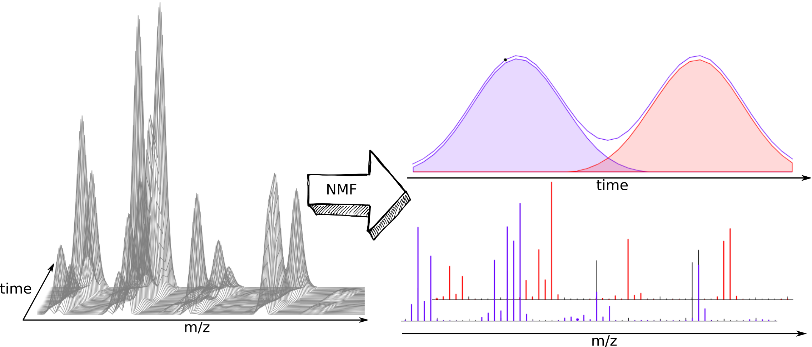

# nGMCA - non-negative Generalized Morphological Component Analysis

<p align="center">
  
</p>
<p align="center">
  A tool for non-negative matrix factorization.
</p>
## Instalation
`$ npm install ml-ngmca `

## [API Documentation](https://mljs.github.io/nGMCA/)

This algorithm is based on the article [Jérémy Rapin, Jérôme Bobin, Anthony Larue, Jean-Luc Starck. Sparse and Non-negative BSS for Noisy Data, IEEE Transactions on Signal Processing, 2013.IEEE Transactions on Signal Processing, vol. 61, issue 22, p. 5620-5632, 2013.](https://arxiv.org/pdf/1308.5546.pdf)

In order to get a general idea of the problem you could also check the [Wikipedia article](https://en.wikipedia.org/wiki/Non-negative_matrix_factorization).

## Usage

You will be able to separate the components of a mixture if you have a series of measurements correlated by a composition profile e.g NMR or mass spectra coming from a chromatographic coupled technique of two or more close retention times. So you will have a matrix with a number of rows equal or greater than the number of pure components of the mixture.

```js
import { Matrix } from 'ml-matrix';
import { ngmca } from 'ml-ngmca';

let pureSpectra = new Matrix([[1, 0, 1, 0]]);
let composition = new Matrix([[ 1, 2, 3, 2, 1]]);

// matrix = composition.transpose().mmul(pureSpectra)
let matrix = new Matrix([
  [1, 0, 1, 0],
  [2, 0, 2, 0],
  [3, 0, 3, 0],
  [2, 0, 2, 0],
  [1, 0, 1, 0],
]);

const options = {
  maximumIteration: 200,
  phaseRatio: 0.4,
};
const result = ngmca(matrix, 1, options);
const { A, S } = result;
const estimatedMatrix = A.mmul(S);
const diff = Matrix.sub(matrix, estimatedMatrix);
```

The result has the matrices A and S, the estimated matrices of compositions and pureSpectra respectively. It's possible that the matrices A and S have not the same scale than pureSpectra and composition matrices because of AS has an infinity of combination to get the target matrix.

## License

[MIT](./LICENSE)
